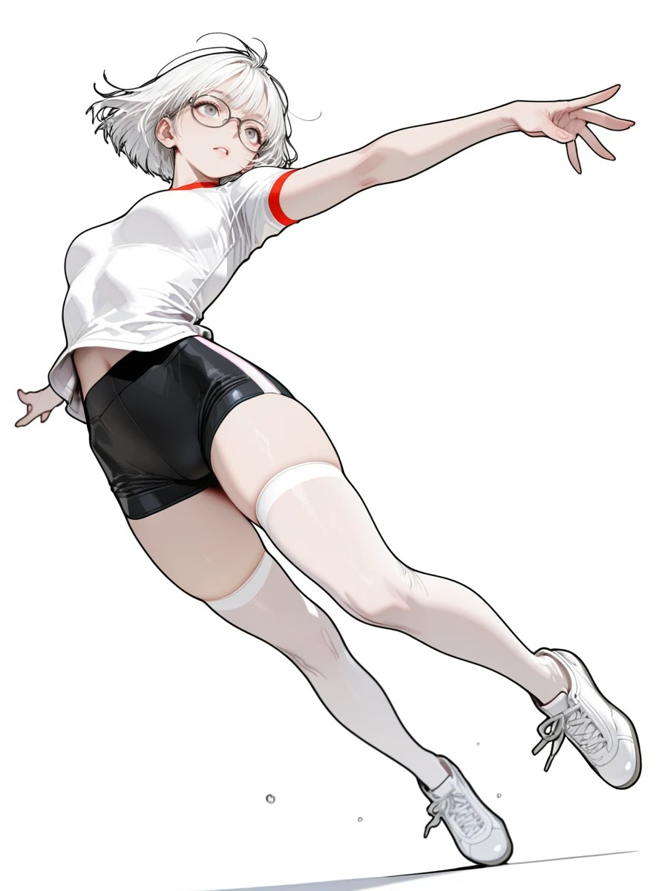

<p align="center">
  
</p>

# Whiteboard Video Engine

[中文](README.md)

<p>
  
  
  
</p>

Local-first whiteboard animation engine for turning SVGs, line-art images, illustrations, and photos into stroke-by-stroke MP4 videos.

The engine focuses on the rendering layer: semantic line-art input, stroke tracing, path ordering, hand cursor following, and contour-aware color fill. The companion Codex Skill is published separately at [gnipbao/codex-whiteboard-video-skill](https://github.com/gnipbao/codex-whiteboard-video-skill).

## Highlights

- Stroke-by-stroke rendering for SVG and raster line art.
- Local neural line-art providers for photos and illustrations.
- Skeleton tracing, path smoothing, and short-stroke merging.
- Built-in fixed-orientation hand cursors: `asian`, `black`, `children`, `white`.
- Multiline CJK layout with stroke tracing and line-by-line wipe reveals.
- Contour-aware color fill from the original image.
- Doubao Voice 2 word timing can pace the drawing and produce an editable SRT.
- CLI-first design for scripting, automation, and Codex integration.

## Demo

<table>
  <tr>
    <td width="50%">
      <strong>Input</strong><br>
      
    </td>
    <td width="50%">
      <strong>Output Preview</strong><br>
      <a href="examples/cases/sports-illustration-anime2sketch/output.mp4">
        
      </a><br>
      <a href="examples/cases/sports-illustration-anime2sketch/output.mp4">Open MP4</a>
    </td>
  </tr>
</table>

More examples can be added under `examples/cases/<case-name>/`.

### Photo And Nature Cases

`examples/cases/nature/` shows complex photos, nature-like scenes, portraits, and sports images rendered with the Informative Drawings provider.

<table>
  <tr>
    <td width="25%">
      <strong>Pool</strong><br>
      <br>
      <a href="examples/cases/nature/pool.mp4">
        
      </a>
    </td>
    <td width="25%">
      <strong>Interior</strong><br>
      <br>
      <a href="examples/cases/nature/cool.mp4">
        
      </a>
    </td>
    <td width="25%">
      <strong>Portrait</strong><br>
      <br>
      <a href="examples/cases/nature/girl.mp4">
        
      </a>
    </td>
    <td width="25%">
      <strong>Sports</strong><br>
      <br>
      <a href="examples/cases/nature/halande.mp4">
        
      </a>
    </td>
  </tr>
</table>

## Installation

```bash
python3 -m pip install "git+https://github.com/gnipbao/whiteboard-video-engine.git"
```

For local development:

```bash
git clone https://github.com/gnipbao/whiteboard-video-engine.git
cd whiteboard-video-engine
python3 -m venv .venv
. .venv/bin/activate
pip install -e ".[dev]"
```

Check the runtime:

```bash
whiteboard doctor
```

## Quick Start

Render a photo or illustration:

```bash
whiteboard render-photo input.jpg \
  -o out/whiteboard.mp4 \
  --duration 15 \
  --fps 30 \
  --lineart-provider auto \
  --stroke-detail rich \
  --hand asian \
  --color-fill contour-wipe
```

Render an existing SVG or line-art image:

```bash
whiteboard render-image lineart.png \
  -o out/whiteboard.mp4 \
  --source-image input.jpg \
  --source-fit exact \
  --duration 15 \
  --fps 30
```

Reproduce the included nature case:

```bash
whiteboard render-photo examples/cases/nature/pool.jpg \
  -o out/nature-pool.mp4 \
  --duration 15 \
  --fps 30 \
  --lineart-provider informative \
  --stroke-detail rich \
  --hand asian \
  --tail-color 4.5 \
  --color-fill contour-wipe
```

## CLI

```bash
whiteboard extract-lineart image.jpg -o lineart.png --provider auto
whiteboard render-photo image.jpg -o output.mp4 --duration 15 --lineart-provider auto
whiteboard render-image lineart.png -o output.mp4 --source-image image.jpg --source-fit exact
whiteboard analyze-image lineart.png -o analysis.json --stroke-detail rich
whiteboard list-hands
whiteboard doctor
```

Reveal multiline Chinese text line by line:

```bash
whiteboard render-image lineart.png -o output.mp4 \
  --draw-text-file caption.txt \
  --draw-text-position top \
  --draw-text-align left \
  --draw-text-reveal line-wipe \
  --draw-text-order before \
  --hand none
```

Show a crayon sketch immediately, add detail horizontally, then restore color without stroke tracing:

```bash
whiteboard render-photo input.png -o output.mp4 \
  --duration 10 --tail-color 4 \
  --line-reveal detail-wipe \
  --base-line-opacity 0.76 \
  --color-fill left-to-right-gradient \
  --hand none
```

When Codex has already produced the color storyboards, an explicit scene plan
can bypass both OpenAI planning and image providers. The JSON root can be a
scene array or `{ "scenes": [...] }`. Every item must contain `id`,
`narration`, `image_prompt`, and a positive `duration_sec`; IDs must be ordered
as `1..N` and map to `storyboards/scene_01.png` through `scene_NN.png`.
Optional `annotations` contains at most two short labels with normalized `x`
and `y` positions. Full narration is never embedded in the generated
storyboard. By default it remains in an editable same-basename SRT; pass
`--burn-subtitles` to also burn that SRT into the output MP4 while keeping the
SRT beside it.

```bash
whiteboard run story.md -o out/story.mp4 \
  --scene-plan scene-plan.json \
  --storyboard-dir storyboards \
  --width 1920 --height 1080 --fps 30 \
  --lineart-provider auto \
  --animation-preset block-speedpaint \
  --tts-provider none
```

This silent combination does not require any API key. The explicit plan length
takes precedence over `--scenes` and is included in resume fingerprints.

Common options:

- `--stroke-detail balanced|rich|max`
- `--hand asian|black|children|white|procedural|none` (`asian` by default)
- `--line-thickness 0|N` (`0` adapts to the source line art; a positive integer overrides it)
- `--draw-text "Line one\nLine two"` or `--draw-text-file caption.txt`
- `--draw-text-position top|center|bottom`
- `--draw-text-align left|center|right`
- `--draw-text-reveal stroke|line-wipe`
- `--draw-text-order before|after`
- `--draw-text-width`, `--draw-text-max-height`, `--draw-text-line-spacing`, `--draw-text-font-size`, `--draw-text-font`
- `--color-fill contour-wipe|brush-scan|top-down-blocks|fade`
- `--line-reveal stroke|detail-wipe`
- `--base-line-opacity 0.0-1.0`
- `--tts-provider none|edge|doubao` (`none` produces a silent post-production master)
- `--burn-subtitles` (burn the generated same-basename SRT into `-o` and keep the SRT)
- `--subtitle-font` (default `sans-serif`)
- `--subtitle-font-size` (default `16`)
- `--subtitle-margin-v` (default `22`)
- `--subtitle-outline` (default `1.6`)
- `--captions` / `--no-captions` (deprecated compatibility no-ops; mutually exclusive with `--burn-subtitles`)
- `--color-fill left-to-right-gradient` (soft left-to-right source-color reveal)
- `--lineart-provider auto|informative|anime2sketch`

With `--tts-provider doubao`, the engine requests Seed-TTS 2.0 word timing,
groups it into readable phrase beats, and uses one clock for line art, detail,
block color, and SRT. Measured speech controls narrated scene length; natural
punctuation pauses briefly hold the drawing and the final visual tail stays
subtitle-free. Exact alignment is cached in `audio/scene_NN.alignment.json` and
invalidated when narration, voice, or synthesis settings change.

Generate Doubao narration and also burn the retained sidecar subtitles into
the MP4:

```bash
whiteboard run story.md -o out/story.mp4 \
  --tts-provider doubao \
  --burn-subtitles \
  --subtitle-font sans-serif \
  --subtitle-font-size 16 \
  --subtitle-margin-v 22 \
  --subtitle-outline 1.6
```

## Line-Art Models

`render-photo` and `extract-lineart` discover local models from the current working directory. Put model code, weights, and wrapper scripts in the project folder where you run `whiteboard`.

Recommended layout:

```text
my-whiteboard-project/
  .venv-lineart/
    bin/
      python
  tools/
    lineart/
      run_informative_drawings.py
      run_anime2sketch.py
    informative-drawings/              # full upstream repository clone required
      test.py
      model.py
      data.py
      util/
      checkpoints/
        model/
          anime_style/
            netG_A_latest.pth
          contour_style/
            netG_A_latest.pth        # optional
          opensketch_style/
            netG_A_latest.pth        # optional
    Anime2Sketch/                      # full upstream repository clone required
      model.py
      data.py
      utils.py
      weights/
        netG.pth
        improved.bin                 # optional; preferred when available
```

`tools/informative-drawings/` and `tools/Anime2Sketch/` must be complete upstream project checkouts, not empty folders that only contain weights. The wrapper scripts import Python modules from those repositories; keeping only `*.pth` / `*.bin` files is not enough.

Minimum valid setups:

- Informative Drawings: `tools/lineart/run_informative_drawings.py` plus `tools/informative-drawings/checkpoints/model/anime_style/netG_A_latest.pth`.
- Anime2Sketch: `tools/lineart/run_anime2sketch.py` plus `tools/Anime2Sketch/weights/netG.pth` or `tools/Anime2Sketch/weights/improved.bin`.

If models live elsewhere, set explicit commands:

```bash
export WHITEBOARD_INFORMATIVE_DRAWINGS_CMD="/abs/project/.venv-lineart/bin/python /abs/project/tools/lineart/run_informative_drawings.py {input} {output}"
export WHITEBOARD_ANIME2SKETCH_CMD="/abs/project/.venv-lineart/bin/python /abs/project/tools/lineart/run_anime2sketch.py {input} {output}"
```

Supported providers:

- [Informative Drawings](https://github.com/carolineec/informative-drawings): recommended default for photos and semantic line art.
- [Anime2Sketch](https://github.com/Mukosame/Anime2Sketch): recommended for anime, manga, and clean illustration inputs.

See [docs/MODELS.md](docs/MODELS.md) for model paths, environment variables, and wrapper commands.

## Architecture

```text
source image / SVG
  -> local line-art provider
  -> raster skeleton / SVG path parsing
  -> stroke ordering and path smoothing
  -> hand-following renderer
  -> contour-aware color fill
  -> MP4 via FFmpeg
```

Core dependencies:

- Python, Pillow, NumPy, Pydantic
- FFmpeg
- Optional PyTorch stack for local line-art providers

See [docs/ARCHITECTURE.md](docs/ARCHITECTURE.md).

## Codex Skill

Install the companion Skill after installing this engine:

```bash
mkdir -p ~/.codex/skills
git clone https://github.com/gnipbao/codex-whiteboard-video-skill.git \
  ~/.codex/skills/whiteboard-video
```

The Skill repository only contains Codex instructions and a wrapper script. This engine remains the source of truth for rendering behavior.

## Case Gallery

| Case | Provider | Notes |
| --- | --- | --- |
| `sports-illustration-anime2sketch` | Anime2Sketch | White-background illustration, rich strokes, contour color fill |
| `nature` | Informative Drawings | Photos, natural scenes, portraits, and sports images rendered as whiteboard videos |

Future cases should follow:

```text
examples/cases/<case-name>/
  README.md
  input.jpg
  output-preview.gif
  output.mp4
```

## Repository Policy

Do not commit model repositories, model weights, virtualenvs, generated work directories, or user uploads without redistribution permission.

Small curated demos belong under `examples/cases/`.

## License

MIT. Upstream model code and weights keep their own licenses.
