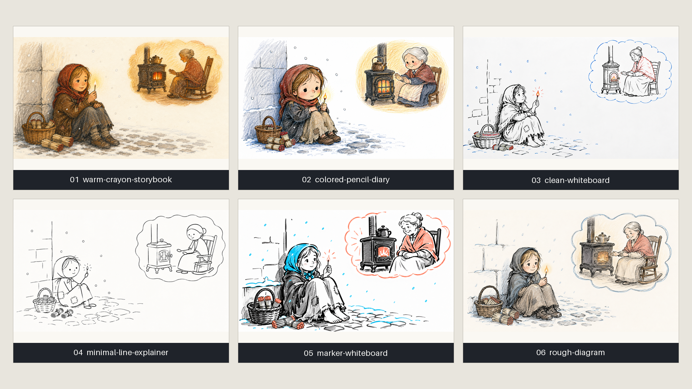
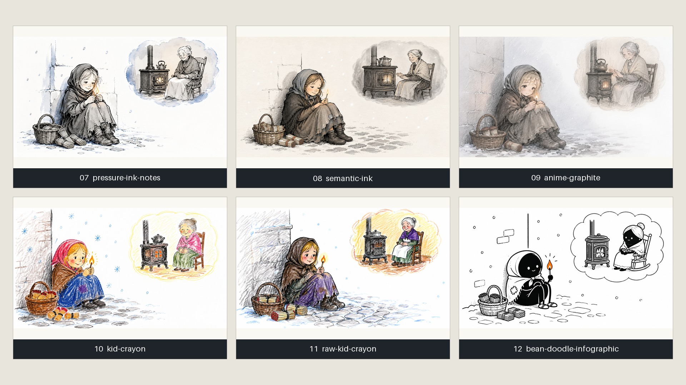
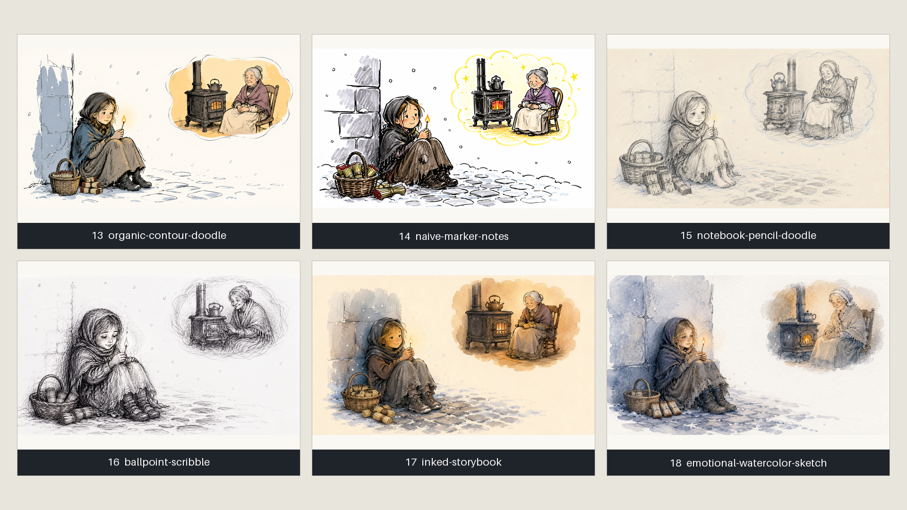
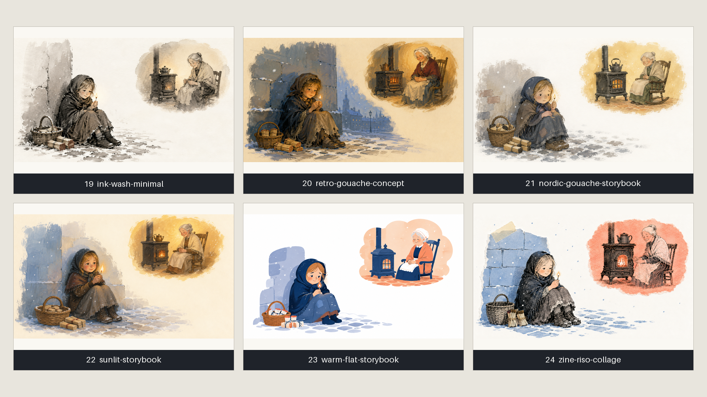
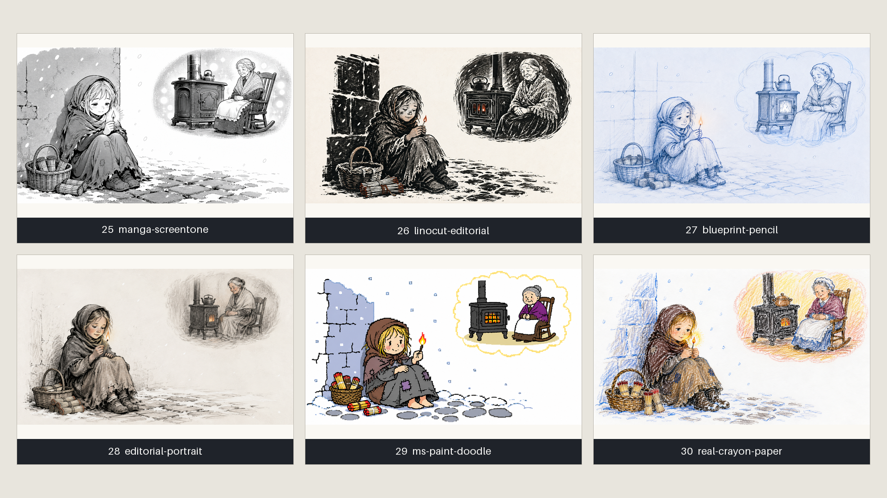

<p align="center">
  
</p>

# 白板手绘视频引擎

[English](README.en.md)

一个本地优先的白板手绘视频引擎，可将 SVG、线稿图、插画和照片转换为逐笔绘制的 MP4 视频。

本仓库专注于底层渲染能力：语义线稿输入、笔画追踪、路径排序、手势跟随和轮廓感上色。Codex Skill 独立维护在 [gnipbao/codex-whiteboard-video-skill](https://github.com/gnipbao/codex-whiteboard-video-skill)。

## 核心能力

- 支持 SVG 和栅格线稿逐笔绘制。
- 支持本地神经网络线稿提取，适配照片、插画和动漫图。
- 支持骨架追踪、路径平滑和短线合并。
- 内置固定角度手势：`asian`、`black`、`children`、`white`。
- 支持多行中文自动排版、手写路径和逐行擦显。
- 支持基于原图的轮廓感上色，可按自然物体分块，也可将完整背景作为全画幅色层统一显现。
- 内置 30 种以画材和制作方法命名的视觉风格，并按白板渲染适配度分级。
- 支持豆包语音 2 词级时间戳驱动手绘节奏，并输出独立 SRT。
- CLI 优先，方便脚本化、自动化和 Codex 集成。

## 与参考项目的实现差异

参考项目 [story-to-handdrawn-video](https://github.com/gnipbao/story-to-handdrawn-video)
提供了很好的 Remotion 风格目录与分层演示。本引擎保留其适合白板的视觉语言，
但把它升级成可批量生产的本地流水线：

| 维度 | 参考项目 | 本引擎 |
| --- | --- | --- |
| 风格 | 20 个提示词风格 | 30 个版本化配方，含 `native/adaptive/experimental` 适配等级、别名、自动推荐和自定义继承 |
| 手绘运动 | [LayerWipe](https://github.com/gnipbao/story-to-handdrawn-video/blob/main/src/LayerWipe.tsx) 用 `clip-path` 横向擦显位图层 | 从真实线稿提取笔画、排序路径，先按自然对象绘制“大轮廓 → 细节”，再可选逐块填色或全画幅统一上色 |
| 物体完整性 | 固定图层时间表 | 连通对象优先成组，独立物体才分块，不为凑块数硬切人物或道具 |
| 图像链路 | 预制黑白、细节与彩图层 | GPT Image 2 只出彩图，同一彩图在本地抽线，线稿与最终色层像素配准 |
| 叙事交付 | README 主流程为 3:4 静音 H.264 | 任意画幅，支持显式分镜、豆包语音 2、词级节奏、可编辑 SRT 与可选烧字 |
| 可复用性 | 选择内置风格 | 行内方向或受限 JSON `extends`；风格快照、模型/模板、素材与渲染参数均参与分阶段缓存 |

这不是把同一张图套 30 个名称：配方会同时进入分镜构图、生成提示词和实际
渲染参数。纯渲染参数变化只重绘视频，不会无意义地重新调用分镜或图片 API。
第三方风格只改写为通用画材语言，并保留 MIT 来源声明；不复制样图、笔刷或
模型权重。


## 效果演示

<table>
  <tr>
    <td width="50%">
      <strong>输入图</strong><br>
      
    </td>
    <td width="50%">
      <strong>输出预览</strong><br>
      <a href="examples/cases/sports-illustration-anime2sketch/output.mp4">
        
      </a><br>
      <a href="examples/cases/sports-illustration-anime2sketch/output.mp4">查看 MP4</a>
    </td>
  </tr>
</table>

后续案例可继续放入 `examples/cases/<case-name>/`。

### 照片与自然场景案例

`examples/cases/nature/` 展示了复杂照片、自然场景、人物照片和体育梗图在 Informative Drawings provider 下的手绘白板效果。

<table>
  <tr>
    <td width="25%">
      <strong>Pool</strong><br>
      <br>
      <a href="examples/cases/nature/pool.mp4">
        
      </a>
    </td>
    <td width="25%">
      <strong>Interior</strong><br>
      <br>
      <a href="examples/cases/nature/cool.mp4">
        
      </a>
    </td>
    <td width="25%">
      <strong>Portrait</strong><br>
      <br>
      <a href="examples/cases/nature/girl.mp4">
        
      </a>
    </td>
    <td width="25%">
      <strong>Sports</strong><br>
      <br>
      <a href="examples/cases/nature/halande.mp4">
        
      </a>
    </td>
  </tr>
</table>

## 安装

```bash
python3 -m pip install "git+https://github.com/gnipbao/whiteboard-video-engine.git"
```

本地开发：

```bash
git clone https://github.com/gnipbao/whiteboard-video-engine.git
cd whiteboard-video-engine
python3 -m venv .venv
. .venv/bin/activate
pip install -e ".[dev]"
```

检查环境：

```bash
whiteboard doctor
```

## 快速开始

渲染照片或插画：

```bash
whiteboard render-photo input.jpg \
  -o out/whiteboard.mp4 \
  --duration 15 \
  --fps 30 \
  --lineart-provider auto \
  --stroke-detail rich \
  --hand asian \
  --color-fill contour-wipe
```

渲染已有 SVG 或线稿图：

```bash
whiteboard render-image lineart.png \
  -o out/whiteboard.mp4 \
  --source-image input.jpg \
  --source-fit exact \
  --duration 15 \
  --fps 30
```

复现内置案例：

```bash
whiteboard render-photo examples/cases/sports-illustration-anime2sketch/input.jpg \
  -o out/sports-illustration-anime2sketch.mp4 \
  --duration 15 \
  --fps 30 \
  --lineart-provider anime2sketch \
  --stroke-detail rich \
  --hand asian \
  --tail-color 4.5 \
  --color-fill contour-wipe
```

## 视觉风格

引擎内置 30 种版本化视觉配方。风格同时约束分镜提示词、纸面、线条、
色板和少量安全的渲染参数；所选配方会写入项目快照和续跑指纹。风格名称只
描述媒介、画材或构图方法，不以艺术家姓名命名。风格系统也不内嵌或在线
下载第三方样图、参考板、笔刷包或纹理素材。

白板适配等级的含义：

- `native`：轮廓和色区天然适合当前抽线、逐笔绘制与对象分块流程。
- `adaptive`：引擎会使用较柔和的线稿或填色参数；建议先看短预览。
- `experimental`：密集纹理、黑色形块或弱轮廓会挑战骨架追踪，结果依赖具体画面。

默认风格是 `warm-crayon-storybook`。`--style` 也接受序号、中文名、英文名
和已注册别名。可用 `WHITEBOARD_STYLE` 设置默认内置风格，命令行选择优先。
参考项目中的 `whiteboard-explainer`、`rawkid-crayon` 和
`ms-paint-bad-doodle` 仍可作为兼容别名直接使用。

第 9 个风格 `anime-graphite` 默认使用 `color_fill_scope=scene`。人物和道具的
线稿仍按自然块绘制，但已配准的完整彩图只做一次全画幅从左到右显现，
避免雪地、墙面、街景或天空被错当成多个矩形前景块。对这类全幅背景，
分镜提示词应把环境写成一个连续、低细节的整体背景，不要生成彼此断开的画框或矩形景片。

### 《卖火柴的小女孩》统一风格预览

为让差异只来自视觉语言，画廊使用同一幅 16:9 标准分镜：19 世纪哥本哈根的
蓝调雪夜，小女孩和火柴位于左下至中部，炉火与祖母幻景位于右上，中间保留
大面积留白。五张联系表按注册顺序覆盖全部 30 种风格。

<p align="center">
  <a href="docs/STYLE_GALLERY.md"></a>
  <a href="docs/STYLE_GALLERY.md"></a>
  <a href="docs/STYLE_GALLERY.md"></a>
  <a href="docs/STYLE_GALLERY.md"></a>
  <a href="docs/STYLE_GALLERY.md"></a>
</p>

[查看完整视觉风格画廊](docs/STYLE_GALLERY.md)，其中包含统一分镜规范、30 风格
索引、适用类型、视觉特征、推荐场景、每张参考图的路径，以及联系表复现命令。
参考原图由 Codex 内置图片生成工具按注册表中的风格配方分别生成；样式标签只在
本地联系表中添加，不会污染后续抽线使用的原图。

查看完整元数据，或只看某一适配等级：

```bash
whiteboard list-styles
whiteboard list-styles --compatibility native
whiteboard list-styles --json
```

根据文案关键词在本地确定性推荐风格，不调用模型或网络：

```bash
whiteboard recommend-styles story.md --limit 5
whiteboard recommend-styles story.md --json
```

直接选风格，或让引擎从文案自动选择第一推荐项：

```bash
whiteboard run story.md -o out/story.mp4 --style colored-pencil-diary
whiteboard run story.md -o out/story.mp4 --style auto
```

也可以给一段行内风格描述，或加载继承内置配方的 JSON。`--style`、
`--custom-style` 和 `--custom-style-file` 三者互斥；`--theme` 是可叠加的
单个故事主题方向，不会改写底层生产安全约束。

```bash
whiteboard run story.md -o out/story.mp4 \
  --custom-style "松弛的蓝色铅笔旅行速写，少量暖橙点色，大面积留白"

whiteboard run story.md -o out/story.mp4 \
  --custom-style-file examples/custom-style.example.json \
  --theme "清晨、克制、带一点希望"
```

JSON 字段、来源说明和安全边界见
[视觉风格来源与自定义说明](docs/visual-style-sources.md)。

## 命令行

```bash
whiteboard extract-lineart image.jpg -o lineart.png --provider auto
whiteboard render-photo image.jpg -o output.mp4 --duration 15 --lineart-provider auto
whiteboard render-image lineart.png -o output.mp4 --source-image image.jpg --source-fit exact
whiteboard analyze-image lineart.png -o analysis.json --stroke-detail rich
whiteboard list-styles
whiteboard recommend-styles story.md
whiteboard list-hands
whiteboard doctor
```

多行中文逐行擦显：

```bash
whiteboard render-image lineart.png -o output.mp4 \
  --draw-text-file caption.txt \
  --draw-text-position top \
  --draw-text-align left \
  --draw-text-reveal line-wipe \
  --draw-text-order before \
  --hand none
```

蜡笔插画直接显线稿、横向补细节并填色（不使用逐笔 stroke）：

```bash
whiteboard render-photo input.png -o output.mp4 \
  --duration 10 --tail-color 4 \
  --line-reveal detail-wipe \
  --base-line-opacity 0.76 \
  --color-fill left-to-right-gradient \
  --hand none
```

使用 Codex 已生成的分镜彩图和显式分镜计划时，可以完全跳过 OpenAI
分镜规划与图片 Provider，只初始化所选的配音 Provider。`scene-plan.json`
既可以是下面的数组，也可以用 `{ "scenes": [...] }` 包一层；ID 必须按
`1..N` 连续排列，并对应 `storyboards/scene_01.png` 至 `scene_NN.png`：

```json
[
  {
    "id": 1,
    "narration": "山上的小庙里，住着三个和尚。",
    "image_prompt": "Three young monks in a mountain temple",
    "duration_sec": 7.5
  }
]
```

```bash
whiteboard run story.md -o out/story.mp4 \
  --scene-plan scene-plan.json \
  --storyboard-dir storyboards \
  --width 1920 --height 1080 --fps 30 \
  --lineart-provider auto \
  --animation-preset block-speedpaint \
  --tts-provider none
```

这条组合路径不需要任何 API Key。`--scene-plan` 中的场景数量是最终
场景数，优先于 `--scenes`；修改计划、彩图、声音或渲染参数后使用
`--resume`，指纹会只重做受影响的阶段。

单图渲染参数（`render-photo` / `render-image`）：

- `--stroke-detail balanced|rich|max`（默认 `rich`）
- `--hand asian|black|children|white|procedural|none`（默认 `asian`）
- `--line-thickness 0|N`（默认 `0`；`0` 根据线稿粗细自动适配，正整数为手动覆盖）
- `--block-fill-style crayon|clean|soft-wash|dry-brush`（默认 `crayon`）
- `--color-fill-scope block|scene`（默认 `block`；`scene` 保留自然线稿分块，但将背景与最终色层作为一次全画幅显现）
- `--draw-text "第一行\n第二行"` 或 `--draw-text-file caption.txt`
- `--draw-text-position top|center|bottom`
- `--draw-text-align left|center|right`
- `--draw-text-reveal stroke|line-wipe`
- `--draw-text-order before|after`
- `--draw-text-width`、`--draw-text-max-height`、`--draw-text-line-spacing`、`--draw-text-font-size`、`--draw-text-font`
- `--color-fill contour-wipe|brush-scan|top-down-blocks|fade|left-to-right-gradient`
- `--line-reveal stroke|detail-wipe`
- `--base-line-opacity 0.0-1.0`
- `render-photo --lineart-provider auto|informative|anime2sketch|anime|manga`

分镜规划与完整流水线风格参数（`plan-script` / `run`）：

- `--style STYLE|auto`（内置风格、序号、名称、别名或自动推荐）
- `--custom-style "..."` / `--custom-style-file style.json`（与 `--style` 互斥）
- `--theme "..."`（叠加当前故事的美术方向）

完整流水线渲染覆盖（仅 `run`）：

- 未显式传入以下选项时，`run` 继承所选风格配方；这些选项用于逐项覆盖。
- `--block-fill-style crayon|clean|soft-wash|dry-brush`
- `--color-fill-scope block|scene`（`block` 在每个自然块内上色；`scene` 将配准彩图和连续背景整体上色）
- `--stroke-detail balanced|rich|max`
- `--line-thickness 0|N`（`0` 为自动线宽）
- `--line-art-snap` / `--no-line-art-snap`，以及 `--line-art-snap-threshold N`
- `--max-draw-blocks N`、`--draw-blocks N`（`0` 表示自动分组）
- `--block-overlap 0..0.65`、`--block-order reading|source`
- `--block-sequence 1,0,...`（显式指定推断块顺序）
- `--hand asian|black|children|white|procedural|none`（默认 `asian`）

`scene` 范围的默认节奏是：自然块线稿在绘画时段的前约 72% 完成，
全画幅色层在约 68% 处开始，与最后细节重叠约 4% 后持续到绘画时段结束。
有配音时，这些比例仍由同一组句子时间戳驱动，停顿处保持画面而不突然跳色。

完整流水线音频与字幕参数（仅 `run`）：

- `--tts-provider none|edge|doubao`（`none` 输出后期配音用的静默母版）
- `--burn-subtitles`（把自动生成的同名 SRT 烧录进 `-o` MP4，同时保留 SRT）
- `--subtitle-font`（默认 `sans-serif`）
- `--subtitle-font-size`（默认 `16`）
- `--subtitle-margin-v`（默认 `22`）
- `--subtitle-outline`（默认 `1.6`）
- `--captions` / `--no-captions`（弃用兼容 no-op；与 `--burn-subtitles` 互斥）

选择 `--tts-provider doubao` 时，引擎请求 Seed-TTS 2.0 的词级时间戳，
将其合并成易读短语并同时驱动线稿、细节、分块上色与 SRT。真实语音时长
决定有声场景长度；标点停顿会短暂停笔，尾帧停留不显示字幕。精确对齐缓存
保存在 `audio/scene_NN.alignment.json`，变更文案、音色或合成参数后会自动失效。

默认情况下，完整旁白不会嵌入生成的分镜图或成片，而是写入同名可编辑
SRT。使用豆包配音并希望成片自带字幕时，可显式烧录；SRT 仍会保留：

```bash
whiteboard run story.md -o out/story.mp4 \
  --tts-provider doubao \
  --burn-subtitles \
  --subtitle-font sans-serif \
  --subtitle-font-size 16 \
  --subtitle-margin-v 22 \
  --subtitle-outline 1.6
```

## 线稿模型

`render-photo` 和 `extract-lineart` 会从当前运行命令的项目目录自动发现本地模型。模型代码、权重和 wrapper 脚本建议放在同一个项目目录的 `tools/` 下。

推荐目录结构：

```text
my-whiteboard-project/
  .venv-lineart/
    bin/
      python
  tools/
    lineart/
      run_informative_drawings.py
      run_anime2sketch.py
    informative-drawings/              # 必须是完整 clone 的上游项目目录
      test.py
      model.py
      data.py
      util/
      checkpoints/
        model/
          anime_style/
            netG_A_latest.pth
          contour_style/
            netG_A_latest.pth        # 可选
          opensketch_style/
            netG_A_latest.pth        # 可选
    Anime2Sketch/                      # 必须是完整 clone 的上游项目目录
      model.py
      data.py
      utils.py
      weights/
        netG.pth
        improved.bin                 # 可选，有则优先使用
```

注意：`tools/informative-drawings/` 和 `tools/Anime2Sketch/` 不是只放权重的空目录，而是需要完整下载对应上游仓库。wrapper 会 `import` 这些仓库里的 Python 模块；如果只放 `*.pth` / `*.bin`，模型无法运行。

最小可用目录：

- Informative Drawings：需要 `tools/lineart/run_informative_drawings.py` 和 `tools/informative-drawings/checkpoints/model/anime_style/netG_A_latest.pth`。
- Anime2Sketch：需要 `tools/lineart/run_anime2sketch.py` 和 `tools/Anime2Sketch/weights/netG.pth` 或 `tools/Anime2Sketch/weights/improved.bin`。

如果模型放在其他位置，可以显式配置命令：

```bash
export WHITEBOARD_INFORMATIVE_DRAWINGS_CMD="/abs/project/.venv-lineart/bin/python /abs/project/tools/lineart/run_informative_drawings.py {input} {output}"
export WHITEBOARD_ANIME2SKETCH_CMD="/abs/project/.venv-lineart/bin/python /abs/project/tools/lineart/run_anime2sketch.py {input} {output}"
```

支持的线稿模型：

- [Informative Drawings](https://github.com/carolineec/informative-drawings)：适合照片和语义线稿。
- [Anime2Sketch](https://github.com/Mukosame/Anime2Sketch)：适合动漫、漫画和白底插画。

模型路径、环境变量和 wrapper 命令见 [docs/MODELS.md](docs/MODELS.md)。

## 架构

```text
原图 / SVG
  -> 本地线稿模型
  -> 骨架提取 / SVG 路径解析
  -> 笔画排序与路径平滑
  -> 手势跟随渲染
  -> 轮廓感上色
  -> FFmpeg 输出 MP4
```

核心依赖：

- Python、Pillow、NumPy、Pydantic
- FFmpeg
- 可选 PyTorch 线稿模型栈

架构细节见 [docs/ARCHITECTURE.md](docs/ARCHITECTURE.md)。

## Codex Skill

安装引擎后，可继续安装配套 Skill：

```bash
mkdir -p ~/.codex/skills
git clone https://github.com/gnipbao/codex-whiteboard-video-skill.git \
  ~/.codex/skills/whiteboard-video
```

Skill 仓库只包含 Codex 指令和 wrapper 脚本，渲染能力以本仓库为准。

## 案例库

| 案例 | 线稿模型 | 说明 |
| --- | --- | --- |
| `sports-illustration-anime2sketch` | Anime2Sketch | 白底插画、丰富笔画、轮廓感上色 |
| `nature` | Informative Drawings | 照片、自然场景、人物和体育图，展示真实照片到白板手绘视频 |

新增案例建议使用：

```text
examples/cases/<case-name>/
  README.md
  input.jpg
  output-preview.gif
  output.mp4
```

## 仓库边界

不要提交模型仓库、模型权重、虚拟环境、生成过程目录，或没有分发授权的用户上传素材。

视觉风格配方仅包含文字描述和数值参数；不内嵌第三方样图或笔刷。完整来源与
命名原则见 [docs/visual-style-sources.md](docs/visual-style-sources.md)。

少量精选演示素材可放在 `examples/cases/`。

## 许可证

MIT。上游模型代码、权重与改编配方遵循各自许可证；保留的版权声明见
[THIRD_PARTY_NOTICES.md](THIRD_PARTY_NOTICES.md)。
